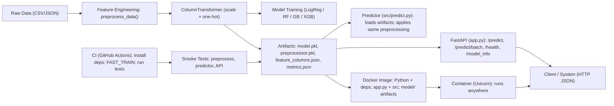

# SaaS Customer Churn Prediction : An End to End MLOps with Python, Pytest, FastAPI, and Docker

An end to end MLOps Pipeline for predicting customer churn using synthetic data that mimics a real SaaS product. My goal for this project was to serve the best predictive model that outputs a  **probability of churn** for each customer as an API so that it is repeatable and other systems can use it too. 

Below is a complete breakdown of my thought process and workflow I followed while building this project:
- [0. Project Architecture](#project-architecture-diagram)
- [1. Tech Stack](#1-techtools-used)
- [2. Problem, data, and goal](#2-problem-data-and-goal)
- [3. Research environment (notebooks): EDA -> feature ideas -> baselines](#3-research-environment-notebooks-eda---feature-ideas---baselines)
- [4. Moving from notebooks to reproducible code (the “single source of truth”)](#4-move-from-notebooks-to-reproducible-code-the-single-source-of-truth)
- [5. Training pipeline and model selection](#5-training-pipeline-and-model-selection)
- [6. Inference Helper](#6-inference-helper)
- [7. Production API (FastAPI)](#7-production-api-fastapi-with-modern-startup-lifecycle)
- [8. Smoke Tests for protecting the pipeline](#8-tests-smoke-tests-that-protect-the-pipeline)
- [9. Continuous Integration (CI) with GitHub Actions](#9-continuous-integration-ci-with-github-actions)
- [10. Containerization with Docker](#10-containerization-with-docker-serving)
- [11. How to run](#11-how-to-run)
- [12. Future Plans](#12-future-additionsgoals-for-this-project)

  


## Project Architecture Diagram





## 1) Tech/Tools used

- Pandas/Numpy/Scikit-learn/XGBoost: data wrangling and ML models.

- FastAPI + Uvicorn: web framework + ASGI server to expose the model via HTTP.

- Pydantic v2: schema validation for request/response models.

- Pytest: automated tests with assertions.

- GitHub Actions: cloud runner that executes your pipeline/tests per push.

- Docker: packaging app + environment into a portable image.


## 2) Problem, data, and goal

**Business problem:** Predict which SaaS customers are likely to churn (cancel) so the team can intervene.

**Data:** Generated a synthetic dataset that mimics a real SaaS product: usage (logins, features used), support tickets, payment failures, satisfaction scores, plan/segment info, and a churn label.

**Goal:** To build a model that outputs a **probability of churn** for each customer and serve it behind an API so other systems can use it.

**Why this matters:** Predicting churn is directly tied to revenue. Turning raw data into an API is what makes the model useful to the business.

---

## 3) Research environment (notebooks): EDA -> feature ideas -> baselines

**EDA (analysis notebook):** Looked at distributions and target relationships. Checked how churn rates vary by:

- **Categoricals:** company size, subscription plan, frequency/recency categories, tenure, value segment.
- **Numerics:** logins, last login days, features used, support intensity, satisfaction, revenue, payment failures.

**Feature engineering (notebook):** Didn’t just one-hot everything. Instead, created **business-meaningful features** such as:

- **Engagement:** `login_engagement_score`, `feature_adoption_rate`, `login_frequency_category`, `login_recency_category`.
- **Risk:** `payment_risk_score`, `satisfaction_risk`, `support_intensity`, `overall_risk_score`, `high_risk_customer`.
- **Lifecycle/value:** `tenure_category`, `revenue_per_feature`, `customer_value_segment`, `activity_score`.

**Transformations & hygiene:** Outlier handling, caps/clips where appropriate, binary flags (e.g., “very old last login”), and clear docstrings explaining each feature.

**My discipline for this project was that** good features beat fancy models. Therefore, I tied features to product behavior, which is how real teams improve signal.

---

## 4) Move from notebooks to reproducible code (the “single source of truth”)

Migrated logic into **versioned Python modules** so the same code is used for training and inference because notebooks are for exploration; modules are for repeatability.

- **`src/data_prep.py`**
  - `preprocess_data(df)`: builds all engineered features from raw inputs.
  - `get_feature_lists_for_model()`: declares which columns are numeric, binary, categorical.
  - `build_preprocessor(...)`: a `ColumnTransformer` with scaling and one-hot encoding; `handle_unknown="ignore"` to protect inference from unseen categories.


---

## 5) Training pipeline and model selection

**`src/train.py`:**

- Loads data, calls `preprocess_data`, builds the preprocessor, splits train/valid.
- Trains a small set of models: **Logistic Regression**, **Random Forest**, **Gradient Boosting** (and optionally **XGBoost**).
- Evaluates with **Accuracy, Precision, Recall, F1, ROC-AUC**; selects the best.
- Saves artifacts to `model/`:
  - `model.pkl` (best estimator)
  - `preprocessor.pkl` (fitted `ColumnTransformer`)
  - `feature_columns.json` (the exact expected columns)
  - `metrics.json` (training metrics for sanity checks)
- Has a `FAST_TRAIN` mode for CI (fewer trees/iters) to keep pipelines quick.

**Why this was important:** Saving both the model **and** the fitted preprocessor guarantees inference uses the exact same transformations as training. The JSON columns file is the “contract”.

---

## 6) Inference helper

**`src/predict.py` -> `Predictor` class:**

- Loads `model/` artifacts once.
- Accepts raw customer JSON or DataFrame.
- Calls `preprocess_data` → transforms with the fitted preprocessor → returns `churn_probability` and `churn_pred` given a threshold.

**Purpose:** Clean separation of concerns. This class is reused by the API and tests, and it shields the rest of the system from implementation details.

---

## 7) Production API (FastAPI) with modern startup lifecycle

**`app.py`:**

- Uses FastAPI **lifespan** to **lazy-load** `Predictor` at startup (modern replacement for deprecated `@on_event("startup")`).

**Endpoints:**

- `GET /health` : liveness check.
- `GET /model_info` : returns `metrics.json` (quick sanity check after deploy).
- `POST /predict` : single record; returns probability and prediction.
- `POST /predict/batch` : many records at once.

Pydantic v2 models for input/output; `model_dump()` used in code.

**Purpose:** A small, typed HTTP interface makes the model useful to other services, dashboards, or analysts. Lifespan avoids import-time crashes and plays nicely with testing.

---

## 8) Tests: smoke tests that protect the pipeline

- `tests/test_preprocess.py` -> verifies preprocessing builds a numeric matrix with no NaNs/infs.
- `tests/test_predictor.py` -> loads artifacts, runs end-to-end on a sample payload, checks probability ∈ [0,1].
- `tests/test_api.py` -> uses `TestClient` as a context manager so lifespan runs; hits `/predict` and checks response shape/code.

**Purpose:** These are **smoke tests** and are simple but powerful. They catch failures early (missing artifacts, bad imports, broken preprocessing).

---

## 9) Continuous Integration (CI) with GitHub Actions

**Workflow**: `.github/workflows/ci.yml` runs on every push/PR:

1. Sets up Python 3.11  
2. Installs dependencies  
3. (Optionally generates data)  
4. Runs `python -m src.train` (FAST mode) to produce artifacts  
5. Sets `PYTHONPATH` and runs `pytest -vv`

**Purpose:** I wanted CI to act as an automated safety net. It rebuilds from scratch and runs tests no accidental broken change is shipped. This is basically a robot installing everything fresh, training a small model, and checking that my pipeline and API still work.

---

## 10) Containerization with Docker (serving)

**Dockerfile:**

- Base: `python:3.11-slim`
- `pip install -r requirements.txt`
- `COPY src`, `app.py`, `model/` into the image
- `CMD ["uvicorn", "app:app", "--host", "0.0.0.0", "--port", "8000"]`

`.dockerignore` to keep images small (skips venvs, notebooks, tests, data).

**Run locally:**
```bash
docker build -t churn-api:latest .
docker run --rm -p 8000:8000 churn-api:latest
# Open http://127.0.0.1:8000/docs
```

---

## 11) How to run:
```bash
# 1) Clone repo; create env; install deps
pip install -r requirements.txt

# 2) Generate data (if needed)
python generate_dataset.py

# 3) Train → creates model/
python -m src.train

# 4) Serve locally (dev)
uvicorn app:app --reload
# http://127.0.0.1:8000/docs

# 5) Tests
pytest -q

# 6) Container (build & run)
docker build -t churn-api:latest .
docker run --rm -p 8000:8000 churn-api:latest
```


## 12) Future additions/goals for this project

Deployment to IaaS: Running the same Docker image on a VM (EC2) with systemd or on a managed service (Cloud Run/ECS).


